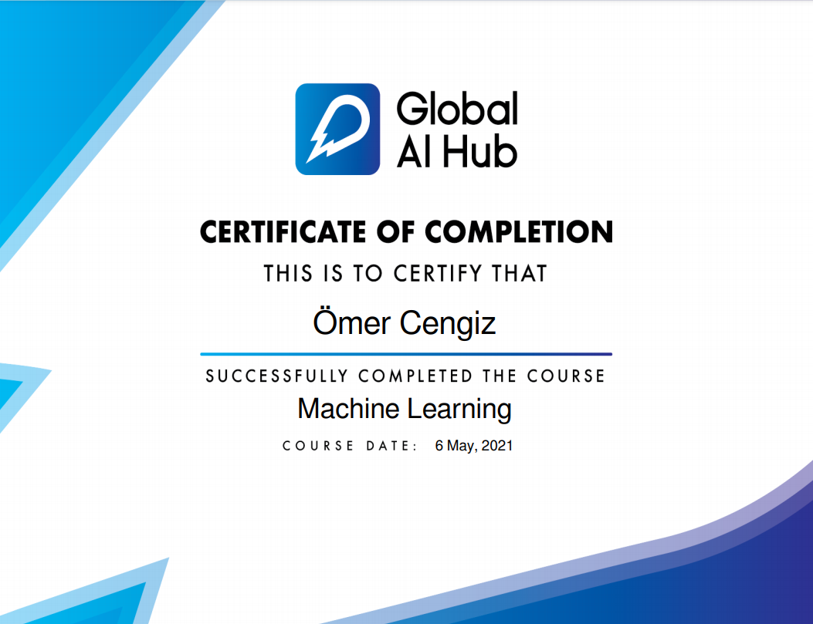

  

# Welcome to our Introduction to Machine Learning Course Repo!

You can find more information about our Introduction to Machine Learning Course by visiting [Course Website.](https://globalaihub.com/introduction-to-machine-learning/)

To enroll our courses, you can find the next course that fit your schedule by visiting [Upcoming Courses.](https://globalaihub.com/upcoming-courses/)

## Syllabus

### Lesson 1
- [Introduction](https://github.com/gaih/introduction-to-machine-learning-v2/blob/main/Day%201/Day%201%20-%20Introduction.ipynb)

### Lesson 2
- [Regression](https://github.com/gaih/introduction-to-machine-learning-v2/blob/main/Day%202/Day%202%20-%20Regression.ipynb)

### Lesson 3
- [Classification](https://github.com/gaih/introduction-to-machine-learning-v2/blob/main/Day%203/Day%203%20-%20Classification.ipynb)

### Lesson 4
- [Decision Trees](https://github.com/gaih/introduction-to-machine-learning-v2/blob/main/Day%204/Day%204%20-%20Decision%20Trees.ipynb)

### Lesson 5
- [Unsupervised Learning](https://github.com/gaih/introduction-to-machine-learning-v2/blob/main/Day%205/Day%205%20-%20Unsupervised%20Learning.ipynb)

## Certification Example

